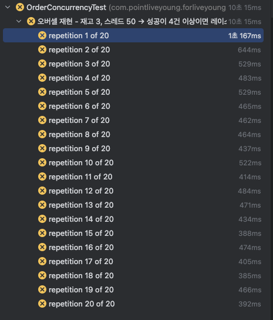

# ADR-010: 상품 주문 시 재고 동시성 제어 방식 선택

## Status

Accepted

## Context

우리 서비스는 포인트로 상품을 구매하는 이커머스 기능을 제공한다.
문제는 여러 사용자가 동시에 같은 상품을 주문할 때 재고 수량이 초과(oversell)되는 현상이 발생할 수 있다는 것이다.

이를 확인하기 위해 동시성 테스트를 수행하였다.

 
- 가정: 특정 상품에 대해 재고 수량만큼만 주문이 성공해야 한다.
- 테스트: 재고 1개 상품에 대해 50명의 사용자가 동시에 주문 → 오직 1건만 성공해야 함.
- 반복 실행: 해당 테스트를 20회 반복했을 때, 단 1회라도 오버셀이 발생하면 동시성 제어가 보장되지 않는 것으로 판단.

현재 상황에서 고려할 수 있는 대안은 다음과 같다.

1. 비관적 락 (Pessimistic Lock)
    - 데이터베이스 수준에서 행 잠금을 사용하여 동시성 문제를 방지.
    - 장점: 구현이 비교적 간단하고, 데이터 무결성을 보장.
    - 단점: 성능 저하 우려, 데드락 발생 가능성.
2. 낙관적 락 (Optimistic Lock)
    - 버전 번호나 타임스탬프를 사용하여 충돌을 감지하고 재시도.
    - 장점: 성능이 우수하고, 데드락 위험 없음.
    - 단점: 충돌이 빈번한 경우 성능 저하, 구현 복잡성 증가.
3. 원자적 연산 (Atomic Operations)
    - 데이터베이스의 원자적 연산 기능을 활용하여 재고 감소를 처리.
    - 장점: 매우 빠르고, 구현이 간단.
    - 단점: 모든 데이터베이스가 지원하지 않음, 복잡한 비즈니스 로직에는 부적합.
4. 분산락 (Redis 기반)
    - Redis와 같은 인메모리 데이터 저장소를 사용하여 분산락을 구현.
    - 장점: 빠른 성능, 확장성 우수.
    - 단점: 추가 인프라 필요, 복잡성 증가.

## Decision

최종적으로 비관적 락 방식을 채택하기로 결정하였다.
- 상품 재고 차감시 SELECT ... FOR UPDATE를 통해 해당 상품 레코드를 잠그고 하나의 트랜잭션이 끝날때까지 다른 요청은 대기하도록하였다.
- 이유:
    - 테스트에서 오버셀 방지가 확실히 보장되었고 주문 도메인에서는 재시도 로직보다 확실한 무결성 보장이 더 중요하다고 판단.
    - 현재 예상되는 주문량이 많지 않아 성능 저하가 크지 않을 것으로 예상됨.
    - 구현이 비교적 간단하여 빠른 적용이 가능.

## Consequences

장점
- 오버셀 방지 확실히 보장.
- 구현이 비교적 간단하며 트랜잭션 내에서 처리되어 코드 복잡성 증가 없음.
  단점
- 트래픽이 몰릴 경우 DB 잠금 대기로 인한 성능 저하 우려.
- 하나의 상품에 대한 동시 접근이 많을 때 병목이 생길수 있다.

추후 고려사항
- 트래픽 증가 시 낙관적 락이나 분산락으로 전환 고려.
- 상품 단위로 접근 빈도가 높은 경우에 캐싱이나 CQRS 구조로 분산 처리 할 수 있을지 검토.
