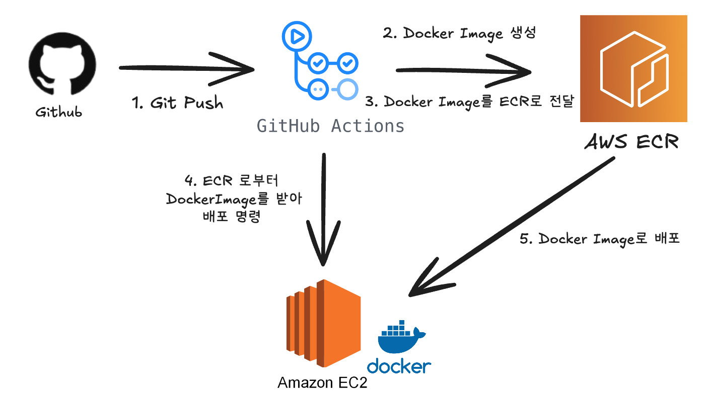

# ADR-015: GitHub Actions + Docker + AWS ECR 기반 CI/CD 도입

## Status
Accepted

## Context
- Spring Boot 애플리케이션을 EC2(Ubuntu) 환경에서 운영하고 있고 현재는 수동으로 Docker 이미지를 빌드하고 배포하고 있다.
- 반복되는 수동 배포 과정에서 사람이 실수할 가능성이 있고 배포 시간이 느리다.
- 그래서 자동화된 CI/CD 파이프라인을 구축할 필요가 있었다.

**방법**
- 소스 코드는 GitHub 로 관리 하고 있다
- GitHub Actions를 이용해 PR에서는 빌드 검증만 수행하고 main 브랜치에 push 될 경우 배포까지 진행하는 워크플로우를 구성한다.
- 컨테이너 이미지는 Docker로 빌드한다.
- 프라이빗 컨테이너 레지스트리는 AWS Elastic Container Registry(ECR)를 사용한다.
- 배포 정책은 main 브랜치에 PR이 머지되면 프로덕션 배포가 수행되도록 한다.

## Decision
- **GitHub Actions + Docker + AWS ECR** 조합을 사용하여 CI/CD 파이프라인을 구축했다.

**Architecture**

1. 개발자가 main 브랜치에 코드를 Push 한다.
2. GitHub Actions에서 코드를 빌드하고 Docker image를 생성.
3. 생성된 Docker Image를 AWS ECR로 Push 한다.
4. GitHub Actions가 EC2에 접속해서 ECR에서 최신 Docker Image를 가져와 배포하도록 명령.
5. EC2는 ECR에서 Docker Image를 pull 한 후에 컨테이너를 실행해서 배포한다.

 

**PR에서는 빌드 검증만하고 main 브랜치에 push 될 경우 배포까지 진행하는 이유**
- PR 단계에서는 코드 변경 사항이 많고 자주 발생해서 빌드 검증만 수행해서 피드백을 준다.
- PR 빌드 때 통과했더라도 머지 과정에서 충돌이나 추가 커밋으로 코드가 달라질 수 있어 main 브랜치에 push 될 때 다시 빌드/배포를 수행한다.

**Docker를 선택한 이유**
- EC2 환경이 로컬 환경과 동일한 Docker 이미지 기반으로 실행되어서 개발/운영 환경 불일치 문제를 줄일 수 있다.
- 컨테이너 단위로 실행/중지/교체가 가능해서 배포 및 롤백이 간단해진다.

**GitHub Actions를 선택한 이유**
- 소스 코드 저장소와 배포 파이프라인을 같은 GitHub에서 관리해서 설정이 단순하다.
- PR, push 이벤트 기반으로 워크 플로우를 실행할 수 있어 브랜치 전략과 자연스럽게 연동이 된다.
- 별도의 러너나 외부 CI 서버를 관리할 필요 없어서 운영 부담이 적다.
- GitHub Secrets 기능을 통해서 민감 정보 관리가 용이하다.

**AWS ECR를 선택한 이유**
- EC2에서 AWS IAM 권한 기반으로 안전하게 Docker 이미지를 pull할 수 있다.
- 태그를 붙여 배포 버전을 관리할수 있고 특정 버전으로 손쉽게 롤백이 가능 하다.
- 같은 리전 내에서 통신해서 Docker Hub 대비 속도, 보안에서 이점이 있다.
- AWS 환경 안에서 CI/CD 자원들을 일관되게 운영할 수 있다.

## Consequences
**Github Actions 우려점과 고려사항**
1. 과금 문제
- GitHub Actions는 무료 사용량이 제한되어 있고 초과 시 과금이 발생한다.
- 빌드/테스트가 길거나 많아지면 비용이 증가할 수 있다.
- Docker Build 이미지 push 과정이 많이 발생하면 과금이 커질 수 있다.

2. 빌드 시간 문제
- 매번 새 VM에서 실행되어서 초기화 시간이 걸린다.

3. 동시 실행 제한
- 무료 플랜은 동시 실행이 제한되어 빌드가 몰리면 대기열에 쌓인다.
- 긴급 배포할 때 지연될 수 있다.

4. 캐싱 활용 필요
- Gradle 빌드 캐시, Docker 레이어 캐시 등을 활용하여 빌드 시간을 단축하는 방법을 고려한다.

5. 워크플로 최적화 필요
- PR에서는 빌드/테스트 검증만 하고 main 브랜치에 push 될 때만 배포를 실행한다.
- concurrency 설정을 통해 오래된 실행을 취소하고 최신 커밋만 빌드하도록 한다.

**장점**
- main 브랜치 merge -> 자동 배포로 이어져 배포 속도와 안정성이 개선된다.
- Docker 기반으로 일관된 실행 환경을 보장한다.
- GitHub Actions로 빌드/배포 파이프라인이 코드 변경과 직접 연계된다.
- AWS ECR로 이미지 보관/배포를 관리해 보안과 운영 효율이 좋아진다.

**단점**
- 단일 EC2 인스턴스 구조라서 확장성과 가용성이 제한된다.
- 롤백 시 특정 이미지 태그를 지정해 수동 실행이 필요하다.
- SSH 스크립트 기반 배포라 스크립트 오류 발생 시 복구가 번거롭다.

**이후 고려사항**
- Docker Compose 같은 오케스트레이션 도구 도입으로 확장성 확보할 수 있다.